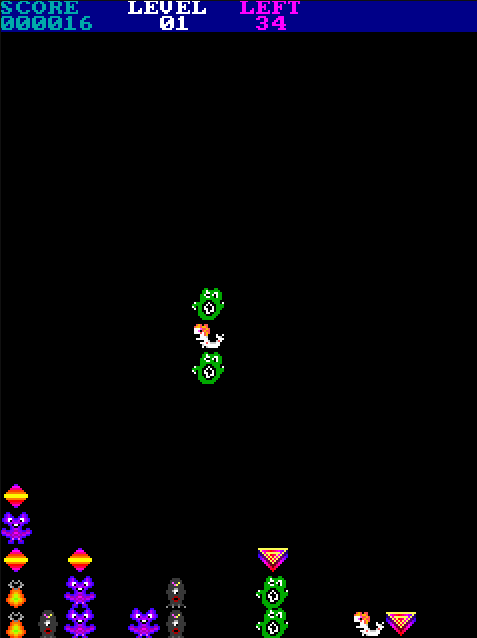

# Jewels Runtime SDL

This project aims to port to the Jewels Runtime to a wide variety of platforms.

Using the SDL2 libraries as a base, the game can now run as a desktop app or in the browser.



## Building the runtime

### Online version

The online version requires SDL2, zlib and Emscripten.

<b> Build cs3 runtime</b>

First install emscripten : https://emscripten.org/index.html

Run these commands

```
$ python bin/gen.py emsdl
$ emmake make
```

<b>Launch the application</b>

```
$ emrun build/jewels.html
```

### Play online

https://cfrankb.com/games/ems/jewels.html
